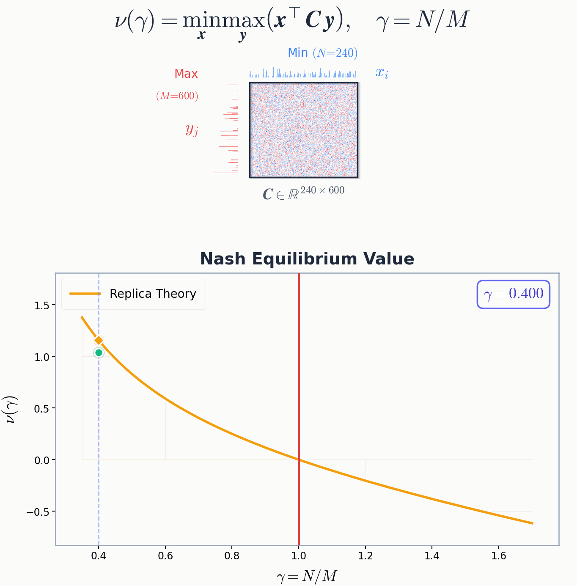

# Thermal Min-Max Games: Unifying Bounded Rationality and Typical-Case Equilibrium

Replica-symmetric (RS) saddle-point predictions vs finite-size numerics for the two-temperature free energy density of random matrix games.

<p align="center">
  
</p>


## Structure

```
src/              Core library (RS solvers, AIS, LP, divided differences, special functions)
experiments/      Experiment scripts (GPU-accelerated)
vis/              Visualization scripts
demo/             Demo scripts (animations, figures)
test/             Tests and diagnostics
script/sh/        SLURM job scripts
data/             Generated .npz data and logs
fig/              Generated figures
```

## Setup

```bash
python -m venv .venv && source .venv/bin/activate
pip install -r requirements.txt
```

Requires PyTorch with CUDA for GPU acceleration.

## Usage

### Zero temperature (RS theory vs LP)

```bash
python -m experiments.run_zeroT_curve --gammas 0.3 0.5 0.8 1.0 1.3 --trials 20 --base_M 80 --seed 0
```

### Finite temperature (RS theory vs Monte Carlo)

```bash
python -m experiments.run_finiteT_check --N 40 --M 80 --beta_max 1.0 --beta_min 1.0 --x_samples 2000 --trials 10 --seed 0
```

## Key Modules

| Module | Description |
|--------|-------------|
| `src/rs_zeroT.py` | Zero-T RS saddle-point solver |
| `src/rs_finiteT.py` | Finite-T RS/1RSB saddle-point solver (7 order parameters) |
| `src/zeroT_lp.py` | LP solver for exact minimax values (HiGHS) |
| `src/finiteT_ais.py` | Annealed Importance Sampling for outer integral |
| `src/divided_differences.py` | GPU-batched divided differences for simplex integrals |
| `src/simplex.py` | Uniform simplex sampling (Dirichlet trick) |
| `src/special.py` | Standard normal PDF/CDF and stable log-space operations |

## Citation

```bibtex
@article{ichikawa2026thermal,
  title={Thermal Min-Max Games: Unifying Bounded Rationality and Typical-Case Equilibrium},
  author={Ichikawa, Yuma},
  journal={arXiv preprint arXiv:2602.14858},
  year={2026}
}
```
